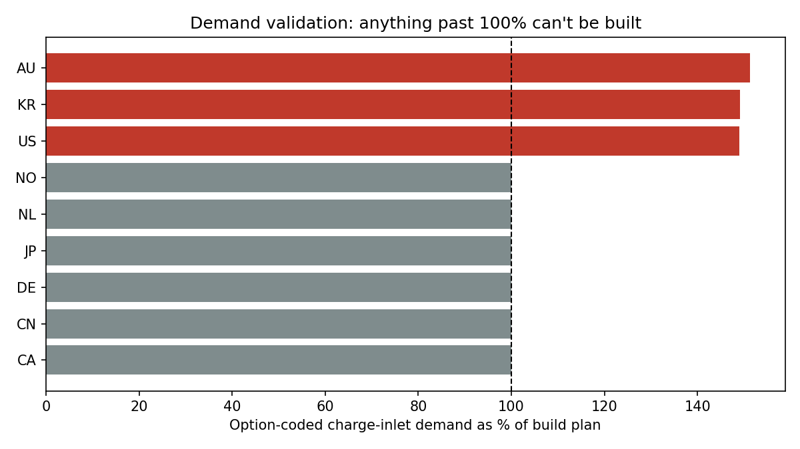
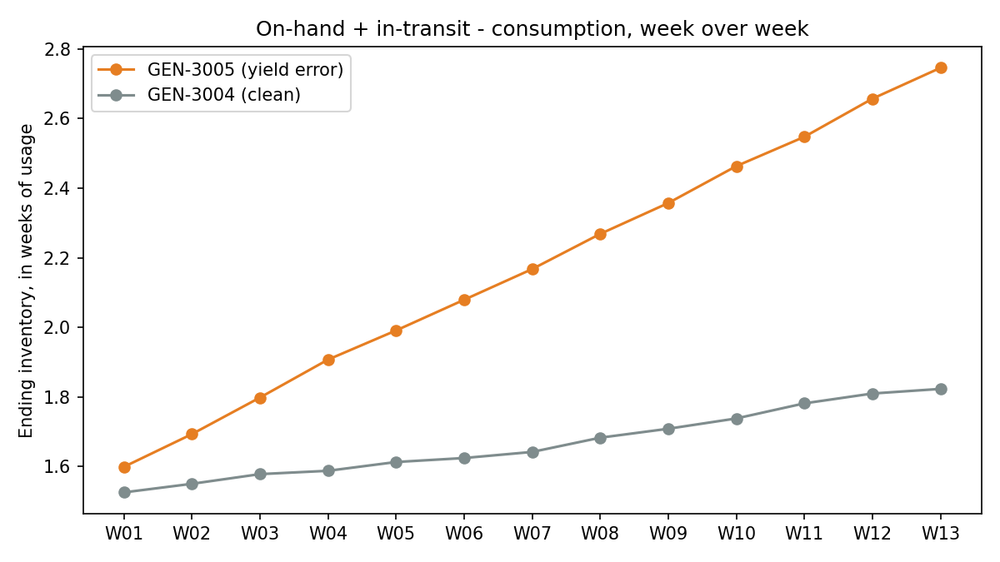
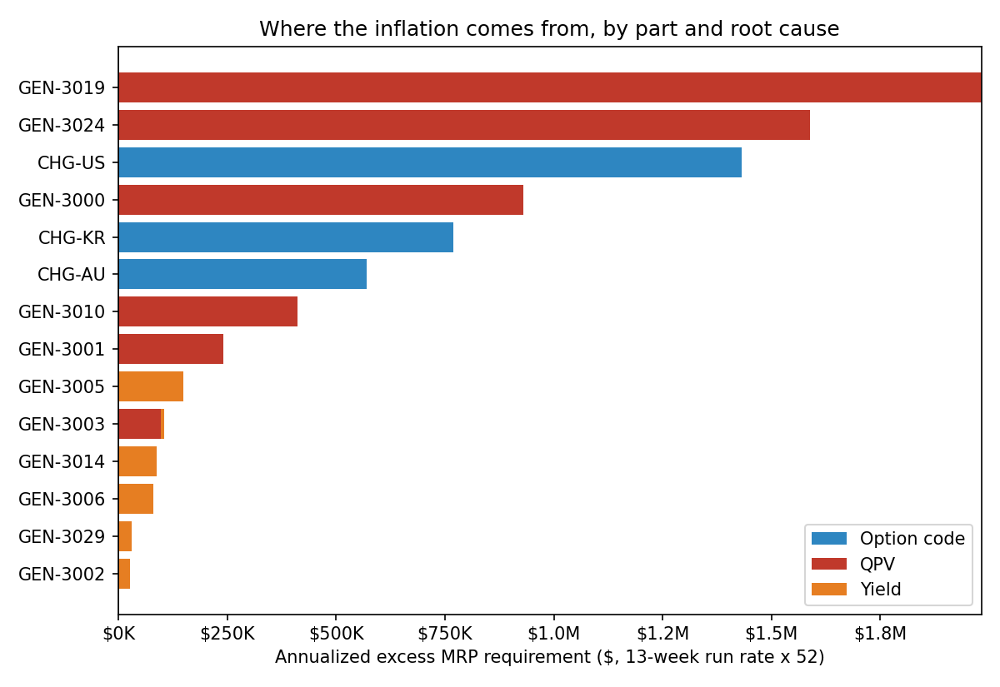

# MRP Demand Audit: three BOM errors that inflate MRP demand

At Tesla I traced a set of manufacturing BOM structuring errors that were inflating MRP demand by about 57% over the actual material consumption plan. Fixing them prevented potential over-procurement worth $8.4M a year.

There was no single bug. There were three, each with its own symptom and its own fix. This repo rebuilds that method in Python on synthetic data, so anyone can run it and see how each check works.

No real company data is used here. Markets, option codes, part numbers, workstations, costs and volumes are all invented.

## How MRP demand gets built

MRP demand for a part is roughly:

```
build plan  x  take rate of the part's option-code key  x  QPV  x  (1 + yield)
```

The build plan comes from S&OP. Everything else lives on the BOM or the part master. If any one of those fields is wrong, MRP multiplies the error across every vehicle in the plan. Nobody sees it until inventory starts piling up.

## Root cause 1: wrong option codes

**What happened.** Some region-coded parts were mapped to both 1-phase and 3-phase charging. That did not match their country code. A Korea part, for example, carried 3-phase charging as well as the 1-phase that Korea uses. MRP then calculated take rate for both, which cannot be true.

**How I caught it.** Demand validation. Option-coded demand should never exceed the build plan it came from. NA + EMEA + APAC demand was adding up to more than the total global build plan, which is impossible.

**The fix.** Find every part whose option codes conflict with its country code. Remove the invalid code, e.g. 3-phase on the Korea part.

**In the code.** `demand_validation()` sums option-coded demand for a one-per-vehicle part family and divides it by the build plan, by market and week. `check_option_codes()` checks each part's codes against the market's charging phase and names the code to remove.



## Root cause 2: inflated yield %

**What happened.** Yield % is set on the BOM. It is a buffer on top of MRP demand to cover expected yield loss. A 20% yield adds 20 units for every 100 units of forecast. If that buffer is wrong, demand is overstated or understated.

**How I caught it.** Inventory snapshots against the same supply. I tracked:

```
ending inventory = on-hand + in-transit - actual consumption
```

week over week. Holdings kept climbing while consumption stayed flat. The root cause was yield: 20% was on the BOM, and 10% was enough. My calculation over that time window gave NPI the number to update the BOM with.

A second route gets to the same answer: check the actual scrap rate at the workstation, and ask whether it justifies the buffer.

**The fix.** NPI updates the BOM yield to what the data supports.

**In the code.** `inventory_trend()` applies the formula above week over week. `check_yield()` compares the BOM yield with the observed scrap rate and recommends the scrap rate, rounded up to the next whole percent. It flags both directions, so an under-buffered part shows up as stockout risk.



## Root cause 3: inflated QPV

**What happened.** Some parts were tagged as consumed at more than one workstation. Each tag carried the full quantity. The BOM summed them, so QPV (quantity per vehicle) came out two or three times too high.

**How I caught it.** Inventory buildup on those parts. I then worked out which workstations actually consumed them and corrected the QPV.

**The fix.** Remove the extra workstation tags.

**In the code.** `check_qpv()` compares BOM QPV, summed across stations, with actual good usage per vehicle built. For flagged parts, it lists the tagged stations that pulled no material, which are the tags to remove.

## Putting it together

`price_impact()` rebuilds each flagged part's weekly MRP requirement twice: as-is, then corrected. It applies the fixes in order (option code, then QPV, then yield), so each root cause gets its own slice and the slices add up.



## Sample run

```
DEMAND VALIDATION (charge-inlet family, one per vehicle)
  Option-coded demand vs global build plan: 15,536 vs 12,715 (122%)
  Markets over 100%: AU 151%, KR 149%, US 149%

FINDINGS: 15 across 14 parts  QPV: 6  YIELD: 6  OPTION_CODE: 3

On the affected parts, MRP was asking for 57% more (by value) than the corrected BOM needs.
Annualized excess requirement: $8,400,000 over-stated, $7,197 under-stated (stockout risk).
```

The full list with the fix for each part is in `output/audit_findings.csv`.

The generator plants 15 known errors and writes them to `sample_data/answer_key.csv`. The audit finds all 15, with no false alarms, and every recommended fix matches the answer key. The tests check this.

The sample is calibrated to the real audit's result: 57% combined inflation and $8.4M a year of over-procurement. The generator sets unit costs so the totals land there. Everything else about the data is synthetic, so the part-level numbers are not real ones. "Annualized" here means the 13-week run rate x 52.

## Run it

```bash
pip install -r requirements.txt
python src/generate_sample_data.py   # optional, sample data is included
python src/mrp_audit.py
pytest tests/                         # optional, needs: pip install pytest
```

## Data files

| File | What it holds |
|---|---|
| `build_plan.csv` | Weekly planned builds by market (S&OP) |
| `market_rules.csv` | Region and charging phase for each market |
| `parts.csv` | Part master: option codes, unit cost, BOM yield |
| `bom_workstations.csv` | Workstation tags and QPV per tag |
| `mrp_vehicle_demand.csv` | Option-coded vehicle demand per part, key and week |
| `inventory_weekly.csv` | On-hand, in-transit, consumption, scrap, vehicles built |
| `station_consumption.csv` | Material actually issued at each tagged station |
| `answer_key.csv` | The planted errors, for validation |

## About

I'm Sandeep Nemmani, Manager of Service Material Planning at Tesla, with 9+ years in supply chain planning.

[LinkedIn](https://www.linkedin.com/in/sandeep-nemmani-4534974a/)
